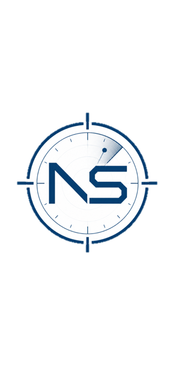
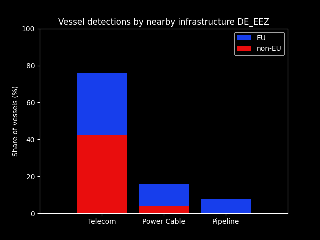

# NS-Monitor

### Research Report — 004

**Maritime Geo-Risk Intelligence · North Sea Basin**

Ergebnisse von drei aufeinanderfolgenden longitudinalen nächtlichen maritimen Überwachungen in der deutschen AWZ

| | |
|---|---|
| **Report number** | Research Report 004 |
| **Publication date** | 31 August 2026 |
| **Focus** | German EEZ -- Longitudinal Monitoring |
| **Object** | Assess maritime activity around subsea infrastructure |
| **Coverage area** | German Bight |
| **Monitoring periods** | 27-28 July 2026, 03-04 August 2026, 17-18 August 2026 |
| **Daily observation window** | 2030/2130Z |

---

## Executive Summary

Three consecutive longitudinal nighttime maritime monitoring surveys in the German EEZ provided an interesting picture of vessel activity around offshore infrastructure.
  
Across the three monitoring periods, 76% of vessel detections involving vessels travelling below 1 knot were recorded near telecommunications infrastructure, compared with 16% near power cables and 8% near pipelines.
  
The distribution suggests a markedly higher concentration of vessel activity around telecommunications infrastructure compared with the other infrastructure categories monitored.
  
These results are based on three nighttime monitoring campaigns. They should therefore be interpreted as an observation of vessel activity within the surveyed periods and conditions, rather than as evidence of a causal relationship between infrastructure type and vessel presence.
  
A relatively simple dataset, but one that raises interesting questions about how vessel activity is distributed around different types of offshore infrastructure — and what factors may explain these patterns.

