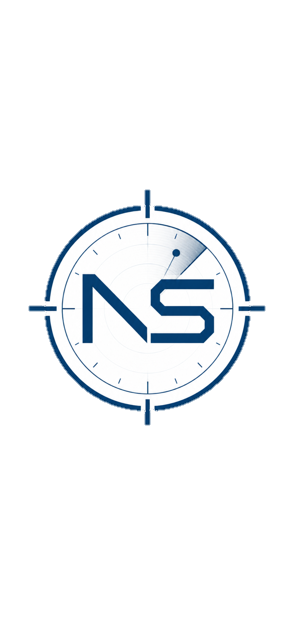

<div align="center">



# NS-Monitor

### Weekly Operational Report — Week 1

**Maritime Geo-Risk Intelligence · North Sea Basin**

| | |
|---|---|
| **Report period** | Operational Week 2 |
| **Publication date** | 17 July 2026 |
| **Coverage area** | North Sea basin |
| **Classification** | Unclassified · Operational summary |

---

</div>

## Executive Summary

During the second operational week, **NS-Monitor** processed over **32,000 unique MMSIs** across the North Sea basin, integrating real-time AIS data with EMODnet datasets on critical subsea infrastructure. Approximately **30 minutes** of cumulative monitoring generated multiple analyst review events; **28 events** were selected for manual analysis based on infrastructure proximity and vessel behaviour.

Preliminary assessment indicates that the flagged activity is **consistent with normal regional maritime traffic**. The report demonstrates how automated screening can help analysts prioritise large volumes of AIS data before manual review.

---

## 1. Introduction

Over the past few months, I have been developing **NS-Monitor**, a maritime geo-risk monitoring platform designed to help prioritise maritime activity around critical infrastructure. The objective is to reduce the number of events that require manual analyst review while maintaining coverage of vessels operating near subsea assets.

This document is the first in an ongoing operational series documenting the development of NS-Monitor and long-term maritime activity trends in the North Sea.

---

## 2. Methodology

### 2.1 Data sources

| Source | Description |
|--------|-------------|
| **AIS (Automatic Identification System)** | Real-time vessel position and identity data |
| **EMODnet Human Activities** | Critical subsea infrastructure: pipelines, power cables, telecommunication cables |

### 2.2 Processing scope

- **Unique vessels (MMSI):** > 32,000
- **Geographic scope:** North Sea basin
- **Monitoring duration:** ~30 minutes (cumulative)
- **Event selection:** Manual analysis subset chosen by infrastructure proximity and vessel behaviour

### 2.3 Analyst Review Queue

An event entering the **Analyst Review Queue** does **not** indicate suspicious or malicious activity. It represents a **prioritised case** for manual assessment based on predefined monitoring criteria (proximity to infrastructure, movement patterns, etc.).

---

## 3. Results

### 3.1 Event breakdown by infrastructure type

| Infrastructure type | Events | Share |
|---------------------|--------|-------|
| Pipelines | 18 | 64.3% |
| Telecommunications cables | 6 | 21.4% |
| Power cables | 3 | 10.7% |
| **Total (analysed subset)** | **28** | **100%** |

### 3.2 Flag-state analysis (preliminary)

Vessels involved in the analysed events are **almost exclusively** registered to countries bordering the North Sea:

| Flag state | Notes |
|------------|-------|
| Netherlands | Primary |
| Norway | Primary |
| Denmark | Primary |
| United Kingdom | Primary |
| Bahamas | Exception (3 total non-regional flags) |
| Cayman Islands | Exception |
| Italy | Exception |

This pattern appears broadly consistent with **legitimate regional maritime traffic** and illustrates the value of automated prioritisation before manual analyst assessment.

### 3.3 Peak activity

Peak activity was recorded at coordinates **53.17°N, 5.41°E**, in the **Dutch Frisian coastal zone** — an area characterised by high offshore infrastructure density and coastal transit routes.

```
Location:  53.17°N, 5.41°E
Region:    Dutch Frisian coastal zone
Context:   High subsea infrastructure density · Coastal transit corridor
```

---

## 4. Limitations

- **AIS coverage** depends on the availability of vessel transmissions and on reception quality; gaps may affect completeness of monitoring.
- **Event flags are prioritisation signals**, not determinations of intent or illegality.
- **Sample size:** The 28 manually analysed events are a subset of all generated review events; broader statistical conclusions require additional operational weeks.

---

## 5. Conclusion

After manual review, the available evidence suggests that the events documented in this report are **consistent with normal maritime activity** in the North Sea. Nevertheless, they provide a useful operational example of how automated screening can help analysts prioritise large volumes of AIS data against critical subsea infrastructure layers.

Future reports in this series will track trends over time, refine flag-state and behaviour analytics, and document platform development milestones.

---

<div align="center">

*This report is part of an ongoing operational series documenting the development of NS-Monitor and long-term maritime activity trends in the North Sea.*

**NS-Monitor** · Maritime Geo-Risk Intelligence

</div>
