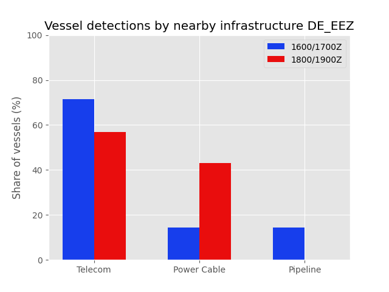

# NS-Monitor

### Research Report — 007

**Maritime Geo-Risk Intelligence · North Sea Basin**

Ergebnisse von zwei longitudinalen maritimen Überwachungen in zwei verschiedenen Zeitfenstern (1600–1700Z und 1800–1900Z) in der deutschen AWZ

| | |
|---|---|
| **Report number** | Research Report 007 |
| **Publication date** | 11 September 2026 |
| **Focus** | German EEZ -- Longitudinal Monitoring |
| **Object** | Assess maritime activity around subsea infrastructure |
| **Coverage area** | German Bight |
| **Monitoring periods** | 31 August - 3 September 2026, 7-9 September 2026 |
| **Daily observation window** | 1800/1900Z, 1800/1900Z |

---

## Executive Summary

Two longitudinal maritime monitoring surveys, conducted across two different time windows (1600–1700Z and 1800–1900Z), provided an interesting picture of vessel activity around offshore infrastructure in the German EEZ.

During the first monitoring period conducted from (7-9 September, 1600–1700Z), 71.4% of vessel detections involving vessels travelling below 1 knot were recorded near telecommunications infrastructure, compared with 14.3% near power cables and 14.3% near pipelines.

During the second monitoring period (31 August - 3 September, 1800–1900Z), 57% of vessel detections involving vessels travelling below 1 knot were recorded near telecommunications infrastructure, compared with 43% near power cables and 0% near pipelines.

The distribution suggests a markedly higher concentration of vessel activity around telecommunications infrastructure compared with the other infrastructure categories monitored.

These results are based on two monitoring campaigns. They should therefore be interpreted as observations of vessel activity within the surveyed periods and conditions, rather than evidence of a causal relationship between infrastructure type and vessel presence.

A relatively simple dataset, but one that raises interesting questions about how vessel activity is distributed around different types of offshore infrastructure — and what factors may explain these patterns.

